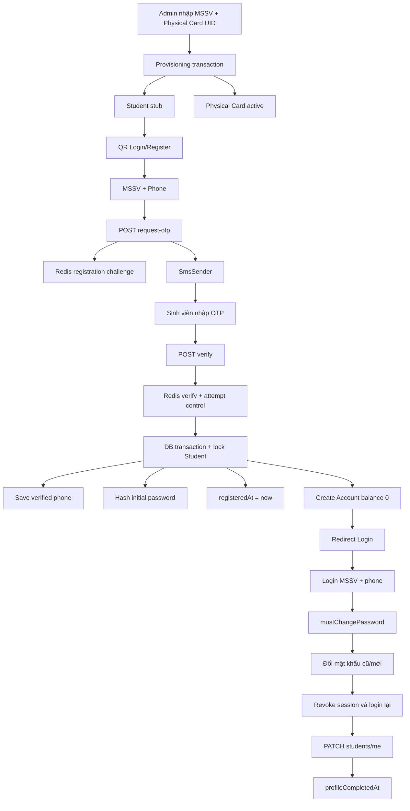
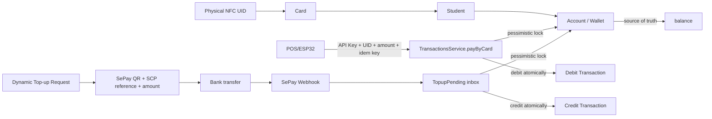
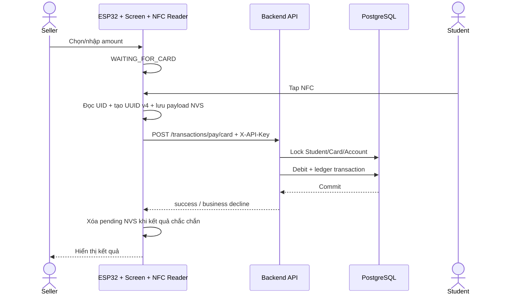
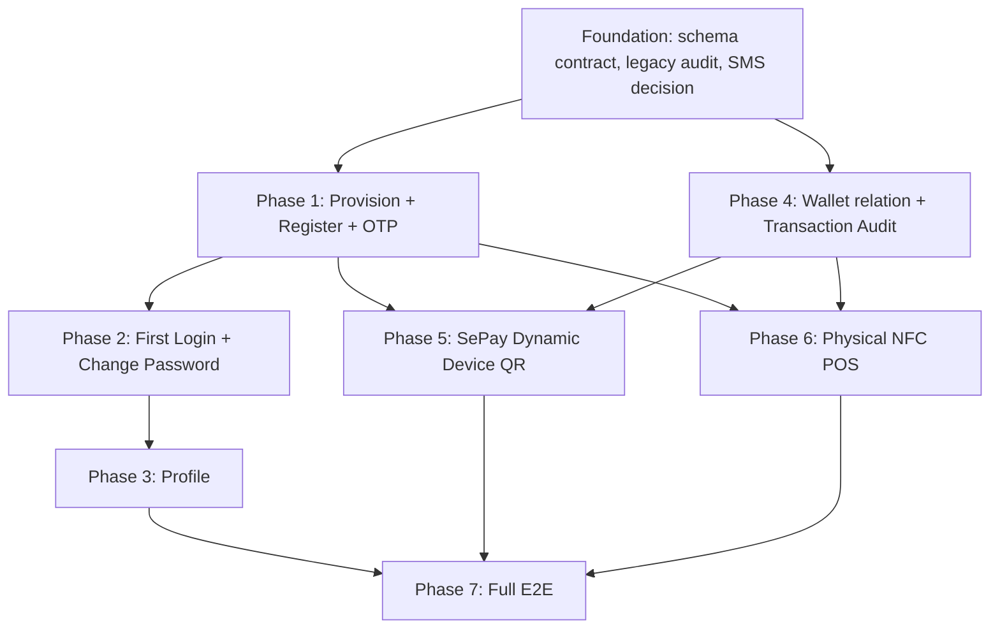

# SmartCampusPay — Implementation Plan V2

> Trạng thái: Tài liệu phân tích và kế hoạch thảo luận. Chưa phải implementation.
>
> Phạm vi: 7 phase — Provisioning, Self Registration + OTP, First Login, Student Profile, Wallet Audit, SePay Top-up, NFC POS và E2E.
>
> Nguyên tắc: NFC chỉ định danh; `Account.balance` trong PostgreSQL là source of truth; ưu tiên tái sử dụng transaction core và SePay hiện tại.

## Executive Summary

Kiến trúc phù hợp nhất là **provision trước, self-register sau**:

1. Admin/nhân viên chỉ provision `MSSV + physical Card UID`.
2. Provisioning tạo Student stub và Card trong cùng transaction; không tạo Account, password hoặc MOCK Card.
3. Sinh viên tự đăng ký bằng MSSV + phone + OTP.
4. Sau OTP hợp lệ, backend lưu phone, tạo password hash, đặt `mustChangePassword=true` và tạo Account balance 0 trong cùng transaction.
5. Lần đăng nhập đầu buộc đổi mật khẩu và đăng nhập lại.
6. Student tự hoàn thiện profile.
7. SePay và NFC payment tiếp tục dùng Account và transaction core hiện tại.

Các phần không nên viết lại gồm transaction locking/idempotency, SePay webhook/inbox/reconciliation, Account làm Wallet, Card lookup/normalization, JWT cookie/refresh architecture và firmware NVS retry foundation.

Không có migration hay implementation nào được thực hiện trong tài liệu này.

---

## 1. Current System Overview

### 1.1 Backend architecture

- NestJS 11, TypeORM, PostgreSQL và Redis.
- API prefix `/api/v1`.
- Global validation, response envelope `{ success, data, timestamp }`, JWT guard và throttling 100 request/phút.
- Module được tách thành Auth, Students, Cards, Accounts, Transactions, Merchants, SePay, Hardware, TopupPending và TopupClaims.
- `synchronize` tắt mặc định; schema được quản lý bằng migration.

### 1.2 Frontend architecture

- Next.js App Router.
- Auth qua httpOnly cookies.
- `proxy.ts` điều hướng theo role và `mustChangePassword`.
- `AuthBoundary` gọi `/auth/me` để xác minh session trước khi render.
- Có cổng admin, student, trang POS web, nạp tiền và đối soát.

### 1.3 Auth

- Hiện có student/admin login, unified login, refresh, logout, change-password và `/auth/me`.
- Chưa có register hoặc OTP.
- Access token 15 phút, refresh token 7 ngày.
- Refresh token hash được lưu trong Redis.
- Student login hiện có side effect không phù hợp flow mới:
  - tự tạo Account nếu thiếu;
  - tự tạo `MOCK-{MSSV}` nếu thiếu Card.
- Unified login lại không thực hiện hai side effect trên, nên hai login path đang không nhất quán.
- Lần đổi mật khẩu bắt buộc hiện không kiểm tra mật khẩu cũ.

### 1.4 Student

- Admin hiện nhập full form: MSSV, họ tên, email, khoa, điện thoại và ngày sinh.
- Create/import đồng thời tạo password từ ngày sinh, Account và MOCK Card.
- API `/students/*` hiện admin-only.
- Profile sinh viên hiển thị dữ liệu nhưng nút chỉnh sửa chưa có logic lưu.

### 1.5 Account

- Account chính là Wallet; không cần Wallet entity mới.
- Có `balance`, `dailyLimit`, `dailySpent`, `dailySpentDate`, `status`.
- DB đã có unique `accounts.studentId`, tức thực tế Student–Account là 1:1.
- Entity vẫn khai báo `Student.accounts: OneToMany` và `Account.student: ManyToOne`.

### 1.6 Card

- UID unique, `studentId` NOT NULL.
- Trạng thái: active, inactive, lost, frozen.
- UID được chuẩn hóa; MOCK UID vẫn được cho phép phục vụ development.
- `updateLastUsed()` tồn tại nhưng payment chưa gọi.

### 1.7 Transaction

- Ledger chung cho debit/credit.
- Có idempotency key unique, SCP reference, card UID, merchant, account và student.
- Payment core đã có:
  - PostgreSQL transaction;
  - pessimistic wallet lock;
  - kiểm tra balance;
  - daily limit;
  - Redis optimization lock;
  - DB unique idempotency là lớp bảo vệ cuối;
  - lost-response lookup bằng idempotency key.

### 1.8 SePay

Đã có hầu hết integration cần thiết:

- QR động phía Student có amount.
- SCP reference.
- Hết hạn 30 phút.
- Polling trạng thái.
- Webhook authentication.
- Account lock và credit atomically.
- Duplicate webhook protection.
- Static QR fallback.
- TopupPending và TopupClaim.
- Device dynamic QR đã có, nhưng amount hiện luôn bằng `0`.

### 1.9 Hardware/POS

Có hai hướng song song:

- Firmware ESP32: reader + màn hình + NVS + HTTPS + merchant API key, gọi backend trực tiếp.
- Web `/pos`: nhập thủ công API key, UID và amount.

`HardwareService/MockCardReader` trong backend chỉ là abstraction mô phỏng nội bộ; nó chưa kết nối với trang web POS hay reader vật lý từ xa.

### 1.10 Snapshot database hiện tại

Kết quả kiểm tra read-only trên PostgreSQL local:

| Chỉ số | Hiện tại |
|---|---:|
| Students | 7 |
| Accounts | 7 |
| Student chưa có password | 1 |
| Student chưa có phone | 1 |
| Student không có active Card | 3 |
| Cards | 4 |
| MOCK Cards | 4 |
| Physical Cards | 0 |
| Nhóm phone bị trùng | 1 nhóm, gồm 3 records |
| Archived Students | 0 |

Hệ quả:

- Không thể thêm global unique phone ngay lập tức.
- Chưa Student nào đủ điều kiện self-register theo rule “phải có physical active Card”.
- Legacy remediation phải là bước bắt buộc trước production rollout.

---

## 2. Gap Analysis

| Requirement | Current | Missing | Need change? | Phase |
|---|---|---|---:|---:|
| Provision MSSV + physical UID | Admin nhập full profile | Contract và transaction provisioning mới | Yes | 1 |
| Student stub nullable profile | fullName/email/faculty NOT NULL | Nullable columns | Yes | 1 |
| Provision không tạo Account | Hiện luôn tạo Account | Bỏ Account khỏi provisioning | Yes | 1 |
| Không tạo MOCK Card production | Create/import/login đều có thể tạo MOCK | Xóa side effect production | Yes | 1 |
| Student self-register | Chưa có | Register API và UI | Yes | 1 |
| OTP SMS | Chưa có provider hoặc abstraction | OTP challenge, sender abstraction | Yes | 1 |
| Redis OTP security | Redis chỉ hỗ trợ token/lock cơ bản | TTL, attempts, resend, atomic consume | Yes | 1 |
| Initial password = phone | Hiện password từ DOB | Hash verified phone | Yes | 1 |
| Account tạo sau OTP | Hiện tạo khi admin/login | Tạo trong registration transaction | Yes | 1 |
| Registration concurrency | Chưa có | Student lock + Redis guard + DB recheck | Yes | 1 |
| First login redirect | Đã có | Giữ và kiểm thử lại | Partial | 2 |
| Nhập mật khẩu cũ lần đầu | Hiện không yêu cầu | Backend và UI phải yêu cầu | Yes | 2 |
| Revoke session sau đổi password | Refresh bị xóa, cookies bị xóa | Blacklist access token hiện tại | Partial | 2 |
| Student Profile self-service | Chỉ hiển thị | GET/PATCH `/students/me` và form | Yes | 3 |
| MSSV readonly | Admin API không update MSSV qua DTO | Self API cần whitelist rõ | Yes | 3 |
| Phone change OTP | Chưa có | Policy; khuyến nghị để future | Later | 3+ |
| Profile completion state | Chưa có | `profileCompletedAt` | Yes | 3 |
| Account source of truth | Đã đúng | Không đổi | No | 4 |
| Account entity 1:1 | DB 1:1, entity 1:N | Sửa mapping TypeORM | Yes | 4 |
| Balance audit snapshots | Chưa có | `balanceBefore`, `balanceAfter` | Yes | 4 |
| Dynamic Student SePay QR | Đã có | Chủ yếu giữ nguyên | Minor | 5 |
| Dynamic device QR amount | Amount hiện bằng 0 | Nhận amount và validate mismatch | Yes | 5 |
| Static QR fallback | Đã có | Giữ nguyên | No | 5 |
| TopupPending/Claim | Đã có | Giữ nguyên | No | 5 |
| NFC payment core | Đã có | Tái sử dụng | No rewrite | 6 |
| POS amount → waiting card | Firmware tap card trước, web nhập UID tay | Sửa firmware/UI state | Yes | 6 |
| Lost HTTP response | Backend và firmware khá tốt | Web POS xử lý 404 chưa đúng contract | Partial | 6 |
| API key placement | ESP32 NVS; web nhập tay | Chốt production architecture | Yes | 6 |
| Full E2E | Money-path khá mạnh | Thiếu registration/profile/password E2E | Yes | 7 |

---

## 3. Target Architecture

### 3.1 Registration, authentication và profile



### 3.2 Wallet, SePay và NFC payment



### 3.3 POS/device communication — recommendation



**Recommendation:** production dùng Option A — ESP32/device gọi backend trực tiếp. Web POS hiện tại nên được coi là test console cho đến khi có yêu cầu chính thức dùng browser + USB reader.

---

## 4. Database Change Plan

| Table | Current | Proposed change | Reason | Migration needed |
|---|---|---|---|---:|
| `students.fullName` | NOT NULL | Nullable | Student stub chưa có profile | Yes |
| `students.email` | NOT NULL, unique | Nullable; giữ uniqueness cho non-null | Student tự cập nhật sau | Yes |
| `students.faculty` | NOT NULL | Nullable | Student tự cập nhật sau | Yes |
| `students.phone` | Nullable, không unique | Giữ nullable; normalize khi verify | Provision không có phone | No column change |
| `students.registeredAt` | Không có | `timestamptz NULL` | Phân biệt self-registered | Yes |
| `students.profileCompletedAt` | Không có | `timestamptz NULL` | Theo dõi hoàn tất profile | Yes |
| `students.passwordHash` | Nullable | Giữ nguyên | Stub chưa có password | No |
| `accounts.studentId` | DB unique | Giữ constraint | Đúng 1:1 | No |
| Account entity mapping | ManyToOne/OneToMany | OneToOne/OneToOne | Đồng bộ entity với schema | Không cần SQL |
| `cards.studentId` | NOT NULL | Giữ nguyên | Card luôn phải thuộc Student | No |
| `cards.uid` | Unique | Giữ nguyên | Chống cấp cùng thẻ hai lần | No |
| `transactions.balanceBefore` | Không có | `int NULL` | Audit số dư | Yes |
| `transactions.balanceAfter` | Không có | `int NULL` | Audit số dư | Yes |
| `transactions.externalReference` | Không có | Chưa thêm mặc định | SePay transferId đã ở TopupPending | No, trừ khi team chốt |
| Phone index | Không có | Có thể partial unique cho self-registration | Ngăn một phone đăng ký nhiều account mới | Decision required |
| Email index | Case-sensitive unique | Cân nhắc partial unique trên `lower(email)` | Case-insensitive, nullable profile | Optional Phase 3 |

### 4.1 Recommendation về phone uniqueness

Không tạo global unique index ngay vì dữ liệu hiện có đã conflict: ba records dùng chung một phone.

Khuyến nghị Phase 1 nếu business xác nhận “một phone chỉ được self-register một Student”:

```sql
CREATE UNIQUE INDEX ... ON students(phone)
WHERE phone IS NOT NULL
  AND "registeredAt" IS NOT NULL
  AND "deletedAt" IS NULL;
```

Nếu cho phép anh/chị/em dùng chung số gia đình thì không được thêm constraint này.

### 4.2 Phân biệt trạng thái không cần enum mới

- **Legacy Student:** `registeredAt IS NULL` và đã có `passwordHash` hoặc Account.
- **Provisioned Student:** `registeredAt IS NULL`, `passwordHash IS NULL`, không Account, có physical active Card.
- **Registered Student:** `registeredAt IS NOT NULL`, có `passwordHash` và Account.
- **Profile completed:** `profileCompletedAt IS NOT NULL`.

Không backfill giả `registeredAt` cho legacy. Record legacy đang có Account nhưng không có password phải được đưa vào báo cáo remediation riêng.

### 4.3 Transaction audit policy

- `balanceBefore` và `balanceAfter` nullable để không phá transaction cũ.
- Transaction success mới phải có đủ hai giá trị theo application invariant.
- Không backfill lịch sử cũ vì không thể suy ra chính xác khi có concurrency hoặc dữ liệu thiếu.
- Chưa thêm `externalReference` vì hiện đã có:
  - `referenceCode` cho SCP QR;
  - `TopupPending.transferId` unique cho SePay;
  - `bankRef` cho đối soát;
  - `idempotencyKey` cho transaction.
- Nếu cần export ledger độc lập khỏi TopupPending, phải định nghĩa rõ semantics trước khi thêm `externalReference`.

---

## 5. API Change Plan

| Method | Endpoint | Current/New | Purpose | Auth | Phase |
|---|---|---|---|---|---:|
| POST | `/students` | Modified | Provision MSSV + physical Card UID | Admin JWT | 1 |
| POST | `/students/import` | Modified | Import `MSSV + Card UID` | Admin JWT | 1 |
| POST | `/auth/register/request-otp` | New | Kiểm tra eligibility, tạo challenge, gửi OTP | Public, strict throttle | 1 |
| POST | `/auth/register/verify` | New | Verify OTP, lưu phone, tạo password + Account | Public, strict throttle | 1 |
| POST | `/auth/login` | Reuse/modify | Login Student, bỏ auto Account/MOCK Card | Public | 1 |
| POST | `/auth/login/unified` | Reuse/normalize | Không có provisioning side effects | Public | 1 |
| POST | `/auth/change-password` | Modified | Luôn verify mật khẩu cũ | Student/Admin JWT | 2 |
| POST | `/auth/logout` | Reuse | Logout và blacklist access token | JWT | 2 |
| GET | `/auth/me` | Reuse | Session/user bootstrap | JWT | 2 |
| GET | `/students/me` | New | Lấy profile chính chủ | Student JWT | 3 |
| PATCH | `/students/me` | New | Cập nhật fullName/email/DOB/faculty | Student JWT | 3 |
| POST | `/sepay/create-payment` | Reuse | Dynamic QR cho Student portal | Student JWT | 5 |
| GET | `/sepay/status/:referenceCode` | Reuse | Poll QR Student | Student JWT | 5 |
| POST | `/sepay/webhook` | Reuse | Nhận bank transfer | SePay API key | 5 |
| POST | `/sepay/static-qr` | Reuse | Static fallback | JWT | 5 |
| POST | `/hardware/topup/qr` | Modified | Thêm required `amount` cùng UID/studentCode | Merchant API key | 5 |
| GET | `/hardware/topup/status/:refCode` | Reuse | Device polling | Merchant API key | 5 |
| GET | `/hardware/students/by-uid/:uid` | Reuse | Resolve Card → Student | Merchant API key | 6 |
| GET | `/hardware/balance/:uid` | Reuse | Lấy server balance | Merchant API key | 6 |
| POST | `/transactions/pay/card` | Reuse | NFC debit | Merchant API key | 6 |
| GET | `/transactions/payments/:key` | Reuse | Resolve lost response | Merchant API key | 6 |

### 5.1 Registration contract đề xuất

#### `POST /auth/register/request-otp`

Input:

```json
{
  "studentCode": "B21DCCN001",
  "phone": "0912345678"
}
```

Output:

```json
{
  "registrationId": "opaque-random-token",
  "expiresInSeconds": 300,
  "resendAfterSeconds": 60
}
```

`registrationId` phải là random opaque token, không phải `studentId`.

Redis challenge chứa:

- studentId;
- normalized phone;
- HMAC/hash OTP, không plaintext;
- expiresAt;
- attemptsRemaining;
- resendAvailableAt;
- trạng thái consumed/verifying.

Backend kiểm tra:

- Student stub tồn tại và active;
- `registeredAt` và `passwordHash` còn null;
- chưa có Account;
- có ít nhất một physical active Card;
- phone hợp lệ;
- phone policy không bị vi phạm.

#### `POST /auth/register/verify`

Input:

```json
{
  "registrationId": "opaque-random-token",
  "otp": "123456"
}
```

Nếu OTP đúng:

1. Acquire registration lock.
2. Bắt đầu DB transaction.
3. Pessimistic lock Student.
4. Recheck trạng thái Student/Card/Account.
5. Lưu verified phone.
6. Hash phone làm initial password.
7. Set `mustChangePassword=true`.
8. Set `registeredAt=now`.
9. Create Account balance 0 với defaults hiện tại.
10. Commit.
11. Consume/delete challenge.

Không tự login. Không trả password. Frontend chuyển về Login.

---

## 6. Frontend Change Plan

| Page/Component | Current state | Required change | Phase |
|---|---|---|---:|
| Student Login | Chỉ login; hướng dẫn password DOB | Thêm link Register; hướng dẫn password phone | 1 |
| Register page | Chưa có | Form MSSV + phone → OTP → success | 1 |
| Auth API/types | Chưa có register contract | Thêm request OTP/verify types | 1 |
| Admin Students | Full create/edit form | Đổi thành provisioning MSSV + Card UID | 1 |
| Admin Import | Full profile Excel | Đổi template thành MSSV + Card UID | 1 |
| Admin student list | Giả định profile luôn đủ | Hiển thị Stub/Legacy/Registered/Profile complete | 1–3 |
| Change Password | Chỉ new + confirm | Thêm current password | 2 |
| Auth routing | Đã redirect mustChange | Giữ, cập nhật test/register public route | 2 |
| Student Profile | Chỉ hiển thị; edit button không lưu | Form PATCH `/students/me` | 3 |
| Student types | fullName/email/faculty non-null | Cho phép nullable trước profile hoàn tất | 1–3 |
| Student Top-up | Dynamic QR đã hoạt động | Chủ yếu reuse; kiểm thử trạng thái/hết hạn | 5 |
| Web POS | Manual API key + UID | Giữ làm test console hoặc tích hợp Local Bridge nếu chọn Option B | 6 |
| POS pending recovery | Có localStorage + Web Locks | Không clear pending chỉ vì lookup trả 404 | 6 |

### 6.1 Register UI state

```text
ENTER_IDENTITY
  → SENDING_OTP
  → ENTER_OTP
  → VERIFYING
  → REGISTERED
```

UI cần xử lý:

- resend cooldown;
- countdown expiry;
- attempts exhausted;
- generic registration eligibility error;
- mất mạng;
- duplicate submission;
- success chuyển về login;
- không lưu OTP/phone nhạy cảm trong localStorage lâu dài.

### 6.2 Profile field policy

Editable:

- fullName;
- email;
- dateOfBirth;
- faculty.

Readonly:

- studentCode;
- phone trong Phase 3;
- registeredAt;
- card/account ownership.

`profileCompletedAt` được set lần đầu khi tất cả field bắt buộc hợp lệ và non-empty. Không cho phép PATCH xóa field thành blank sau khi hoàn thành.

Phone change để future enhancement và phải OTP lại.

---

## 7. Backend Change Plan

### 7.1 Auth

- Thêm request OTP và verify registration.
- Tách OTP lifecycle khỏi `AuthService` để tránh service quá lớn.
- Không lưu OTP plaintext.
- Fail closed nếu Redis không khả dụng.
- Remove auto Account và MOCK Card khỏi login.
- Login chỉ xác thực; không được thay đổi domain data.
- Bắt buộc old password kể cả lần đổi đầu.
- Giữ recommendation “đổi xong logout/login lại”.
- Blacklist access token hiện tại ngoài việc xóa refresh token.

### 7.2 Students

- `create()` chuyển thành atomic provisioning.
- Input chỉ `studentCode`, `cardUid`.
- Create Student + physical Card trong cùng transaction.
- Không Account/password/MOCK.
- Import theo cùng invariant.
- Thêm self-profile GET/PATCH lấy user ID từ JWT.
- Không nhận arbitrary studentId ở self API.
- Tạo derived onboarding status trong response DTO, không cần DB enum.

### 7.3 Accounts

- Giữ Account làm wallet.
- Sửa entity relationship thành OneToOne.
- Cung cấp helper tạo Account bằng `EntityManager` để registration sử dụng chung DB transaction.
- Không tạo Account trong login.
- Giữ default hiện tại: balance 0, dailyLimit 500.000, dailySpent 0.

### 7.4 Cards

- Giữ `studentId` NOT NULL và UID unique.
- Production provisioning phải từ chối UID `MOCK-*`.
- MOCK vẫn được giữ cho seed/test và dữ liệu legacy.
- Card status/lookup hiện tại được reuse.
- Cập nhật `lastUsedAt` sau payment thành công, tốt nhất trong cùng DB transaction.

### 7.5 Transactions

- Không viết lại payment algorithm.
- Bổ sung audit snapshots.
- Khi debit:
  - capture `balanceBefore`;
  - mutate balance;
  - set `balanceAfter`.
- Giữ lock order và idempotency.
- Chuẩn hóa lỗi nghiệp vụ cho firmware.

### 7.6 SePay

- Giữ webhook/inbox/reconciliation.
- Dynamic Student QR gần như không đổi.
- Device QR nhận amount thay vì amount 0.
- Webhook tiếp tục reject/queue nếu amount không khớp.
- Điền balance snapshots khi credit.
- Không bỏ TopupPending/TopupClaim.

### 7.7 Hardware

- `HardwareDeviceService` tiếp tục là facade API cho device.
- `HardwareService/MockCardReader` không phải cầu nối browser-reader; chỉ dùng test/dev.
- Sửa DTO QR top-up có amount.
- Giữ polling thay vì thêm WebSocket trong giai đoạn này.

### 7.8 Merchants

- Giữ raw API key chỉ trả khi create/rotate và hash trong DB.
- Production API key nằm ở thiết bị/bridge, không nằm trong browser public.
- Với số merchant lớn, `ApiKeyGuard` hiện duyệt toàn bộ merchant và bcrypt tuần tự sẽ không scale; chưa cần refactor trong demo hiện tại nhưng phải theo dõi.

---

## 8. Hardware Change Plan

| Hạng mục | Kế hoạch |
|---|---|
| Firmware | Reuse HTTPS, reader, display, NVS, retry; đổi payment state order |
| NFC Reader | Chỉ đọc UID; không đọc/ghi balance |
| Payment state | `ENTER_AMOUNT → WAITING_FOR_CARD → PROCESSING → RESULT` |
| Top-up state | `CARD_IDENTIFIED → SELECT_TOPUP_AMOUNT → CREATE_QR → POLL` |
| API key | Raw key provision vào NVS; DB chỉ lưu hash |
| Idempotency | Sinh UUID v4 một lần, lưu full payload trước request |
| Lost response | Replay đúng payload/key; lookup 404 không chứng minh thất bại |
| Retry | Retry timeout/429/5xx; dừng khi success hoặc business decline chắc chắn |
| Network failure | Không nhận giao dịch mới khi còn pending chưa rõ kết quả |
| NVS | Giữ pending qua reboot; không đổi backend/merchant khi pending |
| Display | WAITING_FOR_CARD, processing, success, insufficient, daily limit, offline |
| WebSocket | Chưa cần; REST + polling phù hợp hiện tại |
| Local Bridge | Chỉ cần nếu team chọn browser POS + USB reader |
| Mock reader | Chỉ development/test, không đưa vào production path |

### 8.1 Option A vs Option B

| Tiêu chí | Option A: ESP32 trực tiếp | Option B: Browser + Local Bridge |
|---|---|---|
| Phù hợp code hiện tại | Rất cao | Thấp/trung bình |
| Firmware hiện có | Gần hoàn chỉnh | Chưa có bridge |
| API key | NVS thiết bị | Bridge local, không phải browser |
| Reader connection | Trực tiếp SPI | USB/Serial → bridge |
| Browser security | Không liên quan | Phải xử lý CORS/local daemon |
| Lost-response persistence | NVS đã có | Bridge cần persistent store |
| Complexity | Thấp hơn | Cao hơn |
| Recommendation | Production | Chỉ chọn nếu bắt buộc web UI lớn |

---

## 9. Phase Dependency



Có thể làm song song:

- Database foundation và SMS provider research.
- Frontend Register mock UI sau khi API contract được chốt.
- Phase 3 frontend và Phase 4 backend audit.
- Phase 5 SePay device flow và Phase 6 firmware sau Phase 4.
- Test automation viết song song từng phase, không đợi Phase 7 mới bắt đầu.

---

## 10. Task Breakdown Cho Team

### 10.1 Backend

| Task | Mục tiêu | Files/modules | Dependency | Complexity | Phase |
|---|---|---|---|---|---:|
| BE-01 | Atomic Student + physical Card provisioning | Students, Cards | DB-02 | High | 1 |
| BE-02 | Registration OTP challenge trong Redis | Auth, Redis | SMS contract | High | 1 |
| BE-03 | SmsSender abstraction | New notifications/SMS module | Provider decision | Medium | 1 |
| BE-04 | Verify OTP + atomic Account registration | Auth, Students, Accounts | BE-01/02 | High | 1 |
| BE-05 | Bỏ Account/MOCK side effects khỏi login | Auth | BE-04 | Medium | 1 |
| BE-06 | Derived onboarding status và legacy handling | Students | DB-01/02 | Medium | 1 |
| BE-07 | Change password old-password + revoke | Auth/JWT/Redis | Phase 1 | Medium | 2 |
| BE-08 | GET/PATCH self profile | Students | Phase 2 | Medium | 3 |
| BE-09 | OneToOne entity alignment | Students/Accounts | DB schema verified | Low | 4 |
| BE-10 | Balance audit snapshots | Transactions, SePay, TopupPending | DB-04 | High | 4 |
| BE-11 | Dynamic device QR amount | HardwareDevice, SePay | BE-10 | Medium | 5 |
| BE-12 | POS contract/error/recovery review | Transactions, error filter | Phase 4 | Medium | 6 |
| BE-13 | Card lastUsedAt atomic update | Transactions/Cards | Phase 6 | Low | 6 |

### 10.2 Frontend

| Task | Mục tiêu | Files/modules | Dependency | Complexity | Phase |
|---|---|---|---|---|---:|
| FE-01 | Link Register trong student login | Login page/CSS | API contract | Low | 1 |
| FE-02 | Register OTP multi-step page | New register page, auth API | BE-02/04 | High | 1 |
| FE-03 | Admin provisioning form MSSV + UID | Admin students | BE-01 | Medium | 1 |
| FE-04 | Provision import contract/status UI | Student API/types | BE-01/06 | Medium | 1 |
| FE-05 | Change password có current password | Change-password page | BE-07 | Low | 2 |
| FE-06 | Editable self profile | Profile page/student API | BE-08 | Medium | 3 |
| FE-07 | Nullable profile-safe rendering | Types/layout/dashboard/admin | DB-02 | Medium | 3 |
| FE-08 | Verify existing Student dynamic QR | Top-up page | Phase 4 | Low | 5 |
| FE-09 | Chốt web POS là test console hoặc bridge UI | POS page | Architecture decision | High if bridge | 6 |
| FE-10 | Sửa unknown payment recovery | POS payment | BE-12 | Medium | 6 |

### 10.3 Database

| Task | Mục tiêu | Dependency | Complexity | Phase |
|---|---|---|---|---:|
| DB-01 | Preflight legacy: password/account/card/phone conflicts | None | Medium | Foundation |
| DB-02 | Nullable profile + onboarding timestamps | DB-01 | Medium | 1 |
| DB-03 | Xác nhận/giữ Account unique 1:1 | DB-01 | Low | 4 |
| DB-04 | Add nullable balanceBefore/balanceAfter | None | Medium | 4 |
| DB-05 | Chốt và triển khai phone uniqueness policy | Product decision | High | 1 |
| DB-06 | Kiểm tra case-insensitive email uniqueness | DB-02 | Medium | 3 |
| DB-07 | Backup, rollback và migration rehearsal | DB-02/04 | High | 7 |

### 10.4 Hardware

| Task | Mục tiêu | Dependency | Complexity | Phase |
|---|---|---|---|---|---:|
| HW-01 | Xác nhận UID format từ reader thật | Physical hardware | Medium | 1 |
| HW-02 | Quy trình cấp thẻ MSSV + UID | BE-01 | Medium | 1 |
| HW-03 | Payment state amount → waiting card | BE-12 | High | 6 |
| HW-04 | Dynamic top-up amount selection | BE-11 | Medium | 5 |
| HW-05 | NVS idempotency/reboot recovery validation | BE payment API | High | 6 |
| HW-06 | Secure API key provisioning/rotation | Merchant API | High | 6 |
| HW-07 | Offline, timeout, decline UI/voice | HW-03 | Medium | 6 |
| HW-08 | End-to-end reader acceptance test | All | High | 7 |

### 10.5 Testing

| Task | Mục tiêu | Dependency | Complexity | Phase |
|---|---|---|---|---|---:|
| TEST-01 | Provisioning atomicity/duplicates | BE-01 | High | 1 |
| TEST-02 | OTP correct/wrong/expired/resend/limit/rate | BE-02/04 | High | 1 |
| TEST-03 | Duplicate/concurrent registration | BE-04 | High | 1 |
| TEST-04 | Legacy login and no data reset | BE-05 | High | 1–2 |
| TEST-05 | First-login guard/change password/session revoke | BE-07/FE-05 | Medium | 2 |
| TEST-06 | Profile ownership/validation/completion | BE-08/FE-06 | Medium | 3 |
| TEST-07 | Audit snapshot correctness | BE-10 | High | 4 |
| TEST-08 | Dynamic/static SePay regression | BE-11 | High | 5 |
| TEST-09 | NFC statuses/balance/limit/idempotency | HW/BE Phase 6 | High | 6 |
| TEST-10 | Lost response/reboot/Redis unavailable/rollback | HW/BE | High | 6 |
| TEST-11 | Full Flow A–F acceptance suite | All | High | 7 |

---

## 11. File Impact Matrix

| File | Phase | Expected change | Risk |
|---|---:|---|---|
| `be/src/modules/students/student.entity.ts` | 1/3/4 | Nullable profile, timestamps, OneToOne Account | High |
| `be/src/modules/students/students.service.ts` | 1/3 | Provision transaction, import, self-profile | High |
| `be/src/modules/students/students.controller.ts` | 1/3 | Provision contract, `/me` routes | Medium |
| `be/src/modules/students/dto/create-student.dto.ts` | 1 | Replace full form with MSSV + UID hoặc deprecate | Medium |
| `be/src/modules/students/dto/import-student.dto.ts` | 1 | MSSV + UID rows | Medium |
| `be/src/modules/students/dto/update-student.dto.ts` | 3 | Separate admin/self field policy | Medium |
| `be/src/modules/students/dto/update-my-profile.dto.ts` **NEW** | 3 | Self-profile whitelist | Low |
| `be/src/modules/auth/auth.controller.ts` | 1/2 | Register endpoints, change-password revoke context | High |
| `be/src/modules/auth/auth.service.ts` | 1/2 | Registration, remove login side effects, password verification | Critical |
| `be/src/modules/auth/auth.module.ts` | 1 | Registration/SMS providers | Medium |
| `be/src/modules/auth/dto/change-password.dto.ts` | 2 | oldPassword required, stronger policy | Low |
| `be/src/modules/auth/dto/request-registration-otp.dto.ts` **NEW** | 1 | MSSV + phone validation | Low |
| `be/src/modules/auth/dto/verify-registration-otp.dto.ts` **NEW** | 1 | registrationId + OTP | Low |
| `be/src/modules/auth/registration-otp.service.ts` **NEW** | 1 | Redis OTP lifecycle | High |
| `be/src/modules/notifications/*` **NEW** | 1 | SmsSender abstraction/mock/production adapter | High |
| `be/src/modules/redis/redis.service.ts` | 1 | Atomic OTP operations hoặc safe raw client usage | High |
| `be/src/modules/accounts/account.entity.ts` | 4 | OneToOne relation | Medium |
| `be/src/modules/accounts/accounts.service.ts` | 1/4 | Manager-aware account creation | High |
| `be/src/modules/cards/cards.service.ts` | 1/6 | Physical UID validation, lastUsed | Medium |
| `be/src/modules/transactions/transaction.entity.ts` | 4 | Balance snapshots | High |
| `be/src/modules/transactions/transactions.service.ts` | 4/6 | Populate audit; preserve locking | Critical |
| `be/src/modules/sepay/sepay.service.ts` | 4/5 | Credit audit; device amount | Critical |
| `be/src/modules/topup-pending/topup-pending.service.ts` | 4 | Manual credit audit | High |
| `be/src/modules/hardware-device/dto/topup-qr.dto.ts` | 5 | Add amount | Low |
| `be/src/modules/hardware-device/hardware-device.service.ts` | 5 | Pass amount to SePay | Medium |
| `be/.env.example` | 1 | SMS configuration names, no secrets | Low |
| `be/src/database/migrations/[NEW]-StudentOnboarding.ts` **NEW** | 1 | Nullable fields/timestamps/index decision | Critical |
| `be/src/database/migrations/[NEW]-TransactionBalanceAudit.ts` **NEW** | 4 | Audit columns | High |
| `be/test/auth-registration.e2e-spec.ts` **NEW** | 1 | Registration/security/concurrency | High |
| `be/test/app.e2e-spec.ts` | 4–6 | Audit, device amount, regression | High |
| `fe/src/app/(auth)/login/page.tsx` | 1 | Register link/help text | Medium |
| `fe/src/app/(auth)/register/page.tsx` **NEW** | 1 | OTP registration UI | High |
| `fe/src/lib/auth-api.ts` | 1/2 | Register APIs, change-password contract | Medium |
| `fe/src/types/auth.ts` | 1 | Registration types/nullable names | Medium |
| `fe/src/proxy.ts` | 1/2 | Public register route và redirects | Medium |
| `fe/src/app/(auth)/change-password/page.tsx` | 2 | Current password field | Low |
| `fe/src/app/student/profile/page.tsx` | 3 | Editable form; remove unusable behavior | High |
| `fe/src/lib/student-api.ts` | 1/3 | Provision và `/students/me` APIs | Medium |
| `fe/src/types/index.ts` | 1–4 | Nullable fields, onboarding/audit types | Medium |
| `fe/src/app/admin/students/page.tsx` | 1 | Provision/import UI | High |
| `fe/src/app/pos/page.tsx` | 6 | Recovery correctness hoặc bridge integration | High |
| `fe/src/lib/pos-payment.ts` | 6 | Preserve unresolved payload correctly | High |
| `docs/esp32-reference.ino` | 5/6 | Payment/top-up state machine | Critical |
| `docs/hardware-api.md` | 5/6 | Contract amount/state/retry | Medium |

---

## 12. Risk / Open Questions

| Severity | Risk | Current assessment / mitigation |
|---|---|---|
| CRITICAL | MSSV ownership | OTP chỉ chứng minh phone ownership; scope hiện tại chấp nhận. NFC challenge là enhancement sau |
| CRITICAL | SMS provider chưa chọn | Phase 1 production không thể hoàn tất nếu chỉ có mock sender |
| CRITICAL | Migration legacy | Có password-null, phone-null, duplicate phone, thiếu card và toàn bộ card hiện là MOCK |
| HIGH | Initial password là phone | Phone entropy thấp; bắt buộc đổi ngay, rate-limit login, không auto-login |
| HIGH | OTP brute force | TTL ngắn, 5 attempts, cooldown, per-IP/student/phone rate limit, HMAC/hash OTP |
| HIGH | Redis unavailable | Registration OTP phải fail closed; không dùng fallback như payment lock |
| HIGH | Concurrent registration | Redis lock + DB Student lock + recheck + Account unique |
| HIGH | Physical UID duplicate | Normalize trước; DB unique là arbiter; Student + Card cùng transaction |
| HIGH | UID cloning | UID-only card có thể bị clone tùy loại thẻ; future secure card/challenge cần đánh giá |
| HIGH | Phone uniqueness | Chưa có policy; DB hiện conflict |
| HIGH | API key trong browser | Không phù hợp production; dùng ESP32 NVS hoặc Local Bridge |
| HIGH | POS lost response | Lookup 404 không được clear pending; phải replay original payload |
| HIGH | Balance audit | Hiện không có before/after; lịch sử cũ không thể backfill chính xác |
| MEDIUM | Duplicate SePay webhook | Hiện đã được bảo vệ tốt bằng inbox + transfer id |
| MEDIUM | Wrong SePay amount/account | Hiện được queue vào TopupPending, nên giữ |
| MEDIUM | Account relation mismatch | Không gây mất dữ liệu nhưng dễ viết code sai |
| MEDIUM | Legacy MOCK Cards | Không xóa; loại khỏi eligibility production |
| MEDIUM | Profile gate | Chưa chốt profile chưa hoàn tất có được payment/top-up hay không |
| MEDIUM | Phone canonical format | Cần chốt `091...` hay `+8491...` làm stored value/initial password |
| MEDIUM | Email case sensitivity | DB unique hiện case-sensitive, service normalize ở một số path |
| LOW | WebSocket | Không cần lúc này; polling đủ cho QR/status |

### 12.1 Open decisions trước implementation

1. Một phone có được dùng cho nhiều Student hay không?
2. Canonical stored phone là `091...` hay `+8491...`?
3. SMS provider production nào được chọn?
4. OTP TTL, attempts và cooldown chính thức là bao nhiêu?
5. Student chưa hoàn tất profile có bị chặn top-up/payment hay chỉ hiển thị cảnh báo?
6. Physical card model cụ thể có chống UID cloning không?
7. Web `/pos` chỉ là test console hay sẽ là production POS?
8. Có cần revoke tất cả session khi đổi password hay chỉ current session?

Recommendation cho phone format: lưu dạng local canonical `0xxxxxxxxx` để initial password đúng như người dùng nhập; chuyển sang E.164 chỉ ở SMS adapter. Team phải chốt trước implementation.

---

## 13. Recommended Implementation Order

1. Chốt business decisions:
   - phone uniqueness;
   - canonical phone format;
   - SMS vendor;
   - profile completion có phải hard gate;
   - production POS chọn Option A.
2. Backup DB và chạy legacy preflight report.
3. Viết và review migration plan Student trước, chưa rollout code registration.
4. Triển khai migration additive:
   - nullable profile;
   - onboarding timestamps.
5. Phase 1 backend:
   - provisioning;
   - OTP;
   - registration transaction;
   - remove login side effects.
6. Phase 1 frontend/admin.
7. Phase 2 change-password và session revoke.
8. Phase 3 self-profile.
9. Phase 4 Account entity alignment và transaction audit.
10. Phase 5 và Phase 6 song song:
    - SePay device amount;
    - firmware NFC payment state.
11. Phase 7 full regression, migration rehearsal và hardware acceptance.
12. Production cutover:
    - disable legacy full-create flow;
    - retain legacy accounts/passwords/MOCK cards;
    - không tự động biến legacy thành self-registered.

---

## 14. Definition of Done Cho Từng Phase

### Phase 1 — Provisioning + Registration + OTP

- Admin provision bằng MSSV + physical UID.
- Student và Card commit/rollback cùng nhau.
- Không Account/password/MOCK.
- OTP có TTL, cooldown, attempts, rate limit.
- OTP không plaintext.
- Phone chỉ lưu sau verify.
- Registration tạo Account balance 0.
- Password hash từ verified phone.
- `mustChangePassword=true`.
- Không auto-login.
- Duplicate/concurrent registration chỉ có một lần thành công.
- Legacy login vẫn hoạt động, không reset dữ liệu.

Required tests:

- Student stub hợp lệ;
- MSSV không tồn tại;
- inactive Student;
- Student không có physical active Card;
- OTP đúng/sai/expired;
- resend cooldown;
- attempt limit;
- per-IP/student/phone rate limit;
- duplicate registration;
- concurrent registration;
- duplicate MSSV/Card provisioning rollback.

### Phase 2 — First Login + Change Password

- Login bằng MSSV + verified phone.
- Student bị khóa khỏi business endpoint trước đổi password.
- Form có current/new/confirm.
- Backend verify current password ngay cả lần đầu.
- Password mới đạt policy và khác password cũ.
- `mustChangePassword=false`.
- Refresh token bị revoke.
- Current access token bị blacklist.
- User phải login lại.
- Guard/proxy/AuthBoundary tests pass.

### Phase 3 — Student Profile

- GET/PATCH `/students/me` hoạt động.
- Không nhận studentId từ client.
- MSSV và phone readonly.
- Full name/email/DOB/faculty được validate.
- Email duplicate bị reject.
- Empty/incomplete profile hiển thị đúng.
- `profileCompletedAt` chỉ set khi đủ field.
- Student không thể sửa profile người khác.

### Phase 4 — Wallet + Transaction Audit

- Entity relation đúng OneToOne.
- Mọi debit/credit mới có balanceBefore/After.
- Audit values khớp balance thực tế.
- Transaction cũ vẫn đọc được với audit null.
- Không endpoint nào cho frontend set balance trực tiếp.
- Concurrency test payment/top-up vẫn pass.

### Phase 5 — SePay Top-up

- Student dynamic QR vẫn hoạt động.
- Device QR nhận đúng amount.
- QR chứa SCP reference và amount.
- Webhook credit đúng một lần.
- Wrong amount/recipient/expired QR được queue, không credit.
- Static QR, TopupPending và TopupClaim không regress.
- Polling trả amount/balance đúng.

### Phase 6 — NFC POS Payment

- POS chọn amount trước.
- Hiển thị WAITING_FOR_CARD.
- Card → Student → Account lookup đúng.
- Debit dùng transaction core hiện tại.
- NVS lưu full pending request trước khi gửi.
- Timeout/reboot retry cùng key.
- Không nhận payment mới khi pending chưa rõ.
- Active/inactive/lost/frozen/nonexistent card đều có kết quả đúng.
- API key không nằm trong public browser production.

Required tests:

- sufficient/insufficient balance;
- daily limit;
- duplicate idempotency key;
- changed payload with same key;
- concurrent payments;
- payment + top-up cùng lúc;
- lost HTTP response;
- retry qua reboot;
- Redis unavailable;
- DB rollback;
- merchant-scoped lookup;
- inactive/revoked merchant key.

### Phase 7 — Integration/E2E

- Tất cả test cases trong yêu cầu được tự động hóa hoặc có hardware acceptance script.
- Migration chạy được trên DB clone có legacy data.
- Rollback strategy được review.
- Không thay đổi balance, password hay lịch sử legacy ngoài phạm vi đã phê duyệt.
- Full Flow A–F chạy end-to-end.
- Backend, frontend, firmware và API docs cùng một contract.
- Không còn production path nào tạo MOCK Card.

---

## 15. Những Phần Hiện Tại Không Nên Viết Lại

Nên giữ và mở rộng tối thiểu:

### Transaction core

- `TransactionsService.pay/payByCard`;
- DB transaction;
- pessimistic Account lock;
- idempotency;
- daily limit;
- rollback;
- Redis optimization + DB uniqueness fallback.

### SePay core

- webhook authentication;
- transfer inbox;
- duplicate handling;
- amount/account/expiry checks;
- account locking;
- static matching;
- TopupPending và TopupClaim reconciliation.

### Domain model và platform

- Account làm Wallet và `balance` là source of truth.
- Card UID normalization và Card status model.
- Merchant raw-key-once + bcrypt hash storage.
- JWT/httpOnly-cookie/refresh architecture.
- `mustChangePassword` guard và AuthBoundary redirect model.
- Response/error envelope.

### Firmware foundation

- HTTPS;
- NFC reader foundation;
- display;
- NVS configuration;
- persisted idempotency payload;
- retry qua reboot;
- QR polling.

### Test foundation

- Existing money-path E2E tests.
- Existing concurrency, overdraft, daily-limit, lost-response, Redis fallback và DB rollback tests.
- Chỉ bổ sung assertions audit và flow mới; không thay bộ test hiện có bằng một suite khác.

Các phần cần thay là **onboarding, profile và hardware state orchestration**, không phải transaction core hoặc SePay core. Đây là ranh giới quan trọng để tránh refactor ngoài phạm vi.

---

## Appendix A — Final Business Flows

### Flow A — Provision

```text
Admin/nhân viên
→ MSSV + Physical Card UID
→ Student stub + Card trong một DB transaction
→ Không Account
→ Không password
→ Không MOCK Card
```

### Flow B — Registration

```text
QR Login
→ Register
→ MSSV + Phone
→ Send OTP
→ Verify OTP
→ Save Phone
→ Create Account
→ Initial Password = Phone
→ mustChangePassword = true
→ Redirect Login
```

### Flow C — First Login

```text
MSSV + Phone
→ Login
→ mustChangePassword = true
→ Change current/new password
→ Revoke session
→ Login lại
→ Student Dashboard
```

### Flow D — Profile

```text
Avatar
→ Profile
→ Update fullName/email/dateOfBirth/faculty
→ profileCompletedAt
```

### Flow E — Top-up

```text
Card/Student identified
→ Enter amount
→ Dynamic SePay QR
→ Bank transfer
→ Webhook
→ Account lock + credit
→ Transaction ledger
```

### Flow F — Payment

```text
POS enter amount
→ WAITING_FOR_CARD
→ NFC tap
→ Card → Student → Account
→ Balance/daily-limit check
→ Debit transaction
→ POS success/failure
```

---

## Appendix B — Configuration Proposal

Không hardcode secret trong code. Các key đề xuất:

```dotenv
SMS_PROVIDER=mock
SMS_API_KEY=
SMS_SENDER_ID=
OTP_HMAC_SECRET=
OTP_TTL_SECONDS=300
OTP_RESEND_COOLDOWN_SECONDS=60
OTP_MAX_ATTEMPTS=5
```

Rules:

- `mock` chỉ dùng development/test.
- Production startup phải fail nếu provider hoặc secret bắt buộc bị thiếu.
- Không log OTP ở production.
- Không đưa SMS/API secrets vào frontend.
- OTP configuration phải có defaults an toàn nhưng vẫn được kiểm soát qua environment.

---

## Appendix C — Review Checklist Trước Khi Implement

- [ ] Product chốt phone uniqueness.
- [ ] Product chốt canonical phone format.
- [ ] SMS provider production được chọn.
- [ ] OTP TTL/cooldown/attempt limit được phê duyệt.
- [ ] Database preflight report được review.
- [ ] Legacy record password-null có remediation owner.
- [ ] Quy trình cấp physical Card được mô tả.
- [ ] Loại card và nguy cơ UID cloning được đánh giá.
- [ ] API contracts được Backend/Frontend/Hardware ký xác nhận.
- [ ] POS production chốt Option A hoặc Option B.
- [ ] Migration backup/rollback plan được Database owner phê duyệt.
- [ ] Definition of Done từng phase được Testing owner xác nhận.

